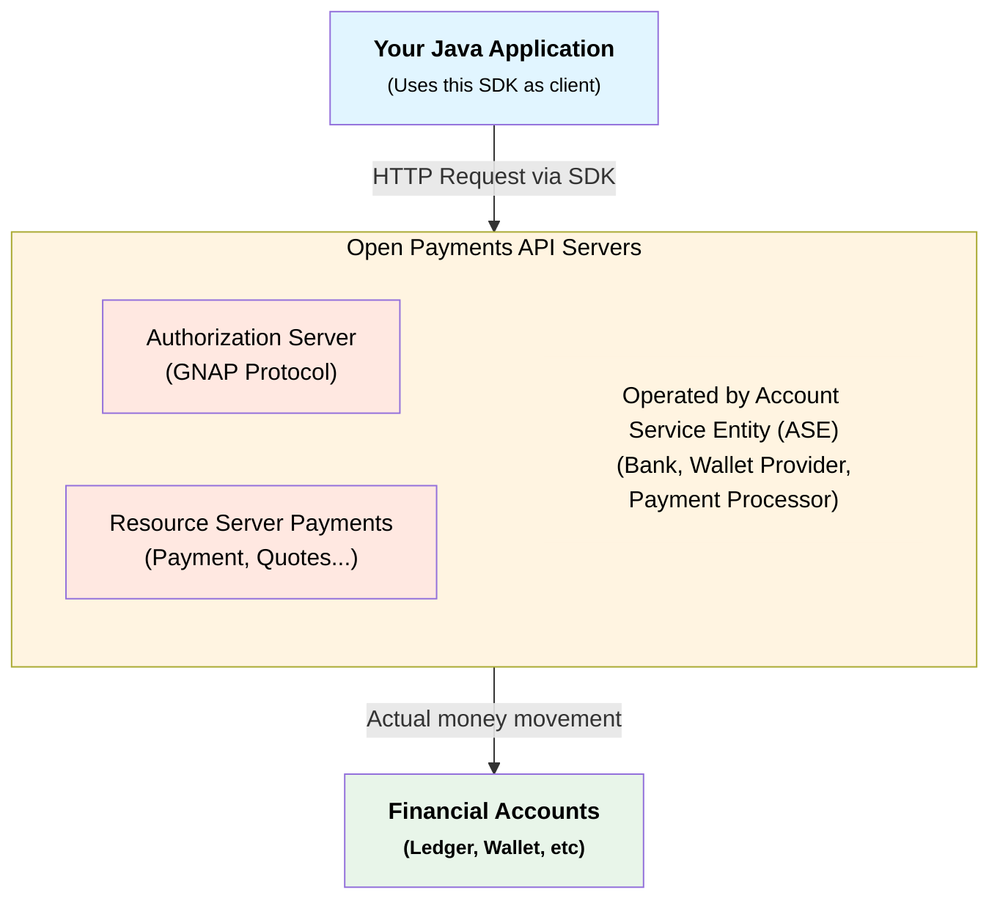

# Open Payments Java SDK

[](https://github.com/boniface/open-payments-java/actions/workflows/ci.yml)
[](https://github.com/boniface/open-payments-java/actions/workflows/ci.yml)
[](https://github.com/boniface/open-payments-java/actions/workflows/ci.yml)
[](https://openjdk.java.net/)
[](LICENSE)
[]()

A modern Java 25 SDK for the [Open Payments API](https://openpayments.dev) - enabling interoperable payments across financial institutions, digital wallets, and payment providers.

---

## 📋 Quick Navigation

**[Features](#features)** | **[Quick Start](#quick-start)** | **[Documentation](docs/INDEX.md)** | **[Project Status](#project-status)** | **[Contributing](#contributing)** | **[License](#license)**

---

## What is Open Payments?

**[Open Payments](https://openpayments.dev)** is an open RESTful API standard that enables applications to interact with financial accounts across different providers in a standardized way. It allows developers to add payment functionality **without becoming licensed financial operators** or building custom integrations for each institution.

**This SDK** is a Java client library that simplifies interaction with Open Payments-enabled accounts (Account Servicing Entities - ASEs). It handles:

- Type-safe API operations for all Open Payments endpoints
- Automatic authentication (HTTP signatures & GNAP tokens)
- Request/response serialization with proper JSON mapping
- Modern async patterns with CompletableFuture



**Important**: This SDK is a client library for communicating with Open Payments APIs. The actual payment processing is performed by the ASEs (banks, wallets) that implement the specification.

## Features

- **Complete API Coverage** - All Open Payments endpoints (wallet addresses, payments, quotes, grants)
- **Modern Java 25** - Records, virtual threads, pattern matching, and latest language features
- **Type-Safe & Immutable** - Compile-time safety with immutable data models
- **Async-First** - Non-blocking operations with `CompletableFuture<T>`
- **Fluent API** - Builder pattern for easy configuration
- **GNAP Authorization** - Full Grant Negotiation and Authorization Protocol support
- **Well-Documented** - Comprehensive JavaDoc and usage guides

## Quick Start

### Prerequisites

- Java 25 or later
- Gradle 9.1+ (wrapper included)

### Installation

**Gradle (Kotlin DSL)**:

```kotlin
dependencies {
    implementation("zm.hashcode:open-payments-java:0.1.0")
}
```

**Maven**:

```xml
<dependency>
    <groupId>zm.hashcode</groupId>
    <artifactId>open-payments-java</artifactId>
    <version>0.1.0</version>
</dependency>
```

> **Note:** Versions 0.x.y are pre-1.0.0 releases. The API may change between releases until 1.0.0 is reached.

### Basic Usage

```java
import zm.hashcode.openpayments.client.OpenPaymentsClient;
import zm.hashcode.openpayments.model.Amount;

// Initialize client
var client = OpenPaymentsClient.builder()
    .walletAddress("https://wallet.example.com/alice")
    .privateKey(privateKey)
    .keyId(keyId)
    .build();

// Get wallet information
var wallet = client.walletAddresses()
    .get("https://wallet.example.com/alice")
    .join();

System.out.println("Wallet: " + wallet.id());
System.out.println("Asset: " + wallet.assetCode());

// Create incoming payment request
var payment = client.incomingPayments()
    .create(request -> request
        .walletAddress(wallet.id())
        .incomingAmount(Amount.of("1000", "USD", 2))
        .expiresAt(Instant.now().plus(Duration.ofDays(1))))
    .join();

System.out.println("Payment URL: " + payment.getId());

// Close client when done
client.close();
```

### Common Use Cases

**Peer-to-Peer Payment**:

```java
var quote = client.quotes()
    .create(q -> q.walletAddress(aliceWallet).receiver(bobIncomingPayment))
    .join();

var payment = client.outgoingPayments()
    .create(p -> p.walletAddress(aliceWallet).quoteId(quote.id()))
    .join();
```

**E-commerce Checkout**:

```java
var checkoutPayment = client.incomingPayments()
    .create(request -> request
        .walletAddress(merchantWallet)
        .incomingAmount(Amount.of("9999", "USD", 2))
        .metadata("{\"orderId\": \"ORD-12345\"}"))
    .join();
```

For more examples, see [docs/QUICK_REFERENCE.md](docs/QUICK_REFERENCE.md).

## Building from Source

```bash
# Clone the repository
git clone https://github.com/yourusername/open-payments-java.git
cd open-payments-java

# Build the project
./gradlew build

# Run tests
./gradlew test

# Format code
./gradlew spotlessApply

# Check for dependency updates
./check-updates.sh
```

> **For complete build documentation**, see [Build Configuration & Developer Guide](docs/BUILD.md)

## Documentation

📚 **[Complete Documentation Index](docs/INDEX.md)** - All guides and references

**Quick Links**:

- [Quick Reference Guide](docs/QUICK_REFERENCE.md) - Common operations and code examples
- [API Coverage](docs/API_COVERAGE.md) - Complete Open Payments API mapping
- [Architecture Guide](docs/ARCHITECTURE.md) - Design principles and component structure
- [Java 25 Features](docs/JAVA_25_FEATURES.md) - Modern Java usage patterns
- [Setup Guide](docs/SETUP.md) - Development environment setup

## Project Status

**Current Stage**: 🚧 Development (Pre-Release)

#### ✅ Completed

- Complete API interfaces and structure
- Java 25 record-based data models
- Full Open Payments API coverage design
- Documentation and architecture decisions
- Build tooling (Gradle, Checkstyle, Spotless)

#### 🚧 In Progress

- Service implementations
- HTTP client integration
- GNAP authorization flow
- Integration tests

#### 📋 Planned

- Complete unit test implementations
- Performance optimization
- Maven Central publication (see [MAVEN_CENTRAL_PUBLISHING.md](MAVEN_CENTRAL_PUBLISHING.md))
- Version 1.0 release

**Version**: 1.0.0-SNAPSHOT | **Target Release**: 1.0.0 | **Java**: 25+

See [PROJECT_STATUS.md](PROJECT_STATUS.md) for detailed roadmap.

## Contributing

We welcome contributions! Whether fixing bugs, adding features, or improving documentation, your help is appreciated.

**Quick Start**:

1. Fork the repository
2. Create a feature branch: `git checkout -b feature/your-feature`
3. Make changes following our code style
4. Run tests: `./gradlew test`
5. Format code: `./gradlew spotlessApply`
6. Commit: `git commit -m "feat: add feature"`
7. Open a Pull Request

See [CONTRIBUTING.md](CONTRIBUTING.md) for detailed guidelines.

## License

Licensed under the [Apache License 2.0](LICENSE).

**Key Points**:

- ✅ Commercial use, modification, and distribution allowed
- ✅ Patent grant included
- ⚠️ Must include license and copyright notice
- ⚠️ No warranty provided

## Support & Resources

- **Documentation**: [openpayments.dev](https://openpayments.dev)
- **Issues**: [GitHub Issues](https://github.com/boniface/open-payments-java/issues)
- **Discussions**: [GitHub Discussions](https://github.com/boniface/open-payments-java/discussions)

## Acknowledgments

- [Open Payments Specification](https://openpayments.dev) - Interledger Foundation
- [GNAP Protocol](https://datatracker.ietf.org/doc/html/draft-ietf-gnap-core-protocol)
- Community contributors

## Related Projects

- [Open Payments PHP SDK](https://github.com/interledger/open-payments-php)
- [Open Payments TypeScript SDK](https://github.com/interledger/open-payments)
- [Open Payments Rust SDK](https://github.com/interledger/open-payments-rs)

---

**Status**: 🚧 Under Development | **Version**: 1.0-SNAPSHOT | **Java**: 25+
