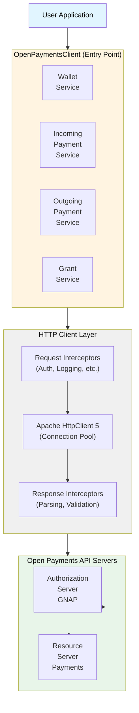
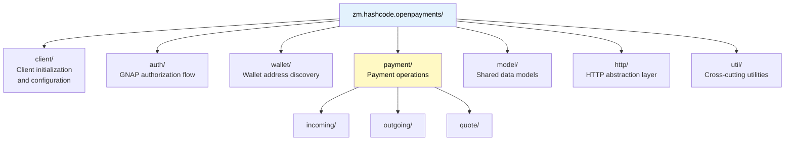
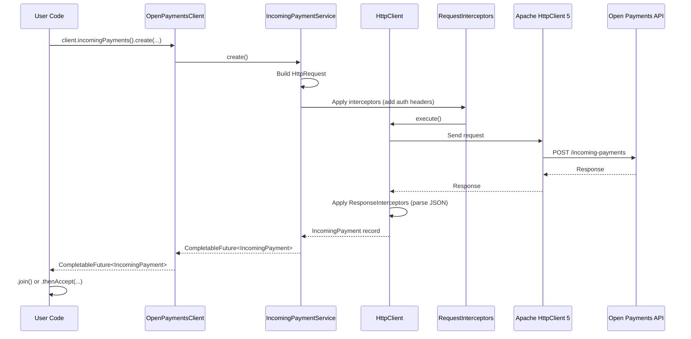
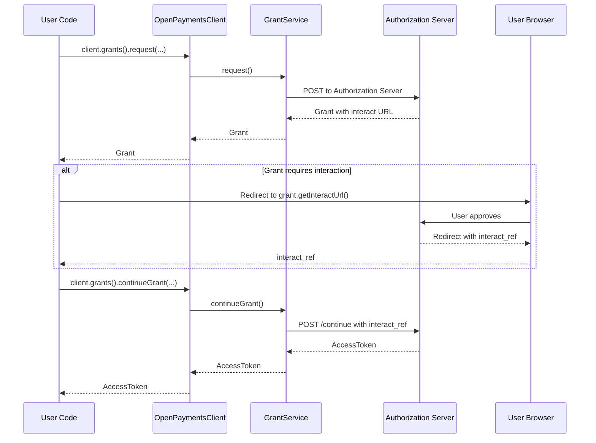
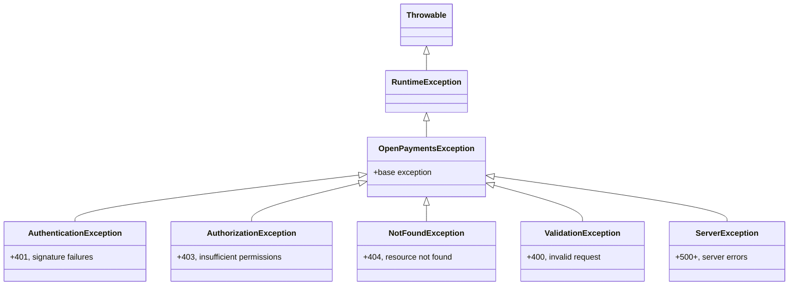

# Open Payments Java SDK - Architecture

[📚 Back to Documentation Index](INDEX.md) | [🏠 Back to README](../README.md)

---

## Overview

This document describes the runtime architecture, component interactions, and system design of the Open Payments Java SDK. For architecture decisions, see [ADR.md](ADR.md). For package organization, see [SDK_STRUCTURE.md](SDK_STRUCTURE.md).

## System Architecture

### Component Diagram



## Package Architecture



## Component Responsibilities

### Client Layer

**Purpose**: Provide single entry point and service access

- `OpenPaymentsClient`: Factory for all services, manages lifecycle
- `OpenPaymentsClientBuilder`: Fluent configuration (wallet address, keys, timeouts)
- **Lifecycle**: Created via builder, closed via AutoCloseable

### Service Layer

**Purpose**: Expose domain operations as clean APIs

- Each service represents one API resource type
- Methods return CompletableFuture for async operations
- Stateless (thread-safe, reusable)
- Delegate HTTP details to HTTP layer

### HTTP Layer

**Purpose**: Abstract HTTP communication and authentication

- `HttpClient`: Interface for HTTP operations
- `HttpRequest`/`HttpResponse`: Immutable request/response records
- `RequestInterceptor`: Add authentication headers (HTTP signatures, bearer tokens)
- `ResponseInterceptor`: Parse responses, handle errors
- **Implementation**: Apache HttpClient 5 with connection pooling

### Model Layer

**Purpose**: Represent API data structures

- Immutable records for all DTOs
- Validation in compact constructors
- Jackson annotations for JSON mapping
- Builders for complex objects

## Runtime Flow Examples

### Payment Creation Flow



### Authorization Flow (GNAP)



## Thread Safety & Concurrency

### Thread-Safe Components

- **OpenPaymentsClient**: Fully thread-safe, can be shared across threads
- **All Services**: Stateless, thread-safe
- **HTTP Layer**: Connection pool handles concurrent requests
- **Models**: Immutable, inherently thread-safe

### Virtual Threads Support

Java 25's virtual threads allow efficient blocking:

```java
// Hundreds of concurrent payment operations
try (var executor = Executors.newVirtualThreadPerTaskExecutor()) {
    var futures = paymentRequests.stream()
        .map(req -> CompletableFuture.supplyAsync(
            () -> client.incomingPayments().create(req).join(),
            executor
        ))
        .toList();

    var results = futures.stream()
        .map(CompletableFuture::join)
        .toList();
}
```

## Error Handling Architecture

### Exception Hierarchy



### Error Propagation

1. HTTP errors → Parsed into OpenPaymentsException
2. Exception includes: HTTP status, error code, message
3. CompletableFuture.completeExceptionally() for async errors
4. Users handle via `.exceptionally()` or catch on `.join()`

## Security Architecture

### Authentication Layers

1. **HTTP Signatures**: All requests signed with private key
2. **Access Tokens**: GNAP tokens included as Bearer tokens
3. **TLS**: All communication over HTTPS (enforced)

### Key Management

- Private keys never transmitted
- Public keys published at `/.well-known/jwks.json`
- Signature verification uses public key retrieval

## Performance Considerations

### Connection Pooling

- Apache HttpClient 5 maintains persistent connections
- Default pool: 20 max connections, 5 per route
- Configurable via `OpenPaymentsClientBuilder`

### Async by Default

- Non-blocking I/O prevents thread exhaustion
- CompletableFuture allows composition without blocking
- Virtual threads make blocking on futures cheap

### Caching

- WalletAddress lookups cacheable (optional)
- Public keys cacheable (TTL based)
- Access tokens managed with expiry tracking

## Related Documentation

- **[ADR.md](ADR.md)**: Architecture decisions and rationale
- **[SDK_STRUCTURE.md](SDK_STRUCTURE.md)**: Package organization and file listing
- **[JAVA_25_FEATURES.md](JAVA_25_FEATURES.md)**: Modern Java feature usage
- **[API_COVERAGE.md](API_COVERAGE.md)**: Complete API mapping
- **[QUICK_REFERENCE.md](QUICK_REFERENCE.md)**: Code examples and usage patterns
